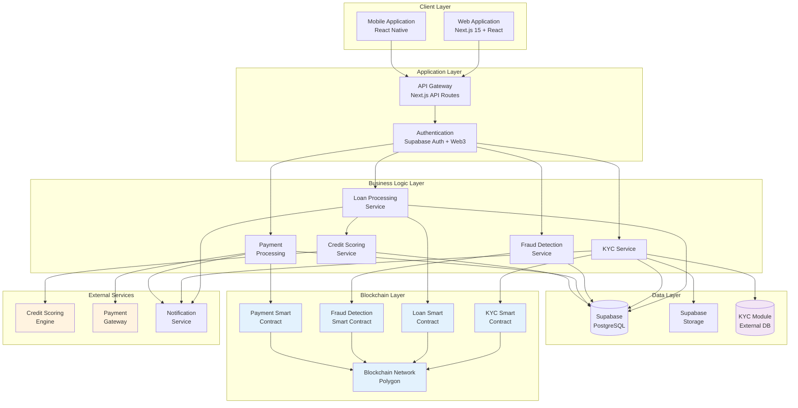
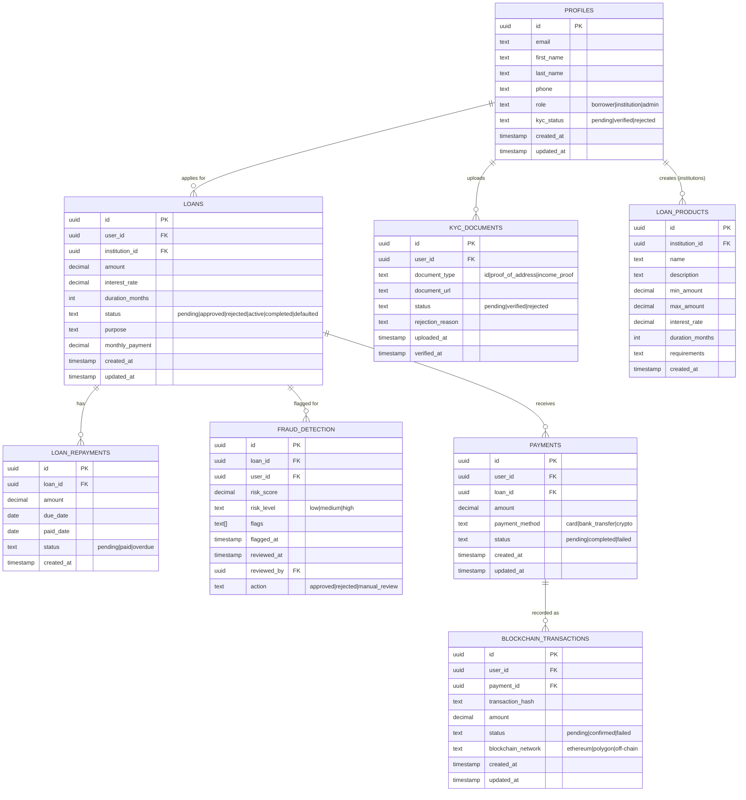

# FinFlow - Smart Microfinance Platform

*Blockchain-powered microfinance with automated KYC, credit scoring, and fraud detection*

[](https://vercel.com/mosesmrimas-projects/v0-microfinance-web-app)
[](https://v0.app/chat/projects/X5j7ozDI0vl)

## Overview

FinFlow is a next-generation microfinance platform that combines traditional lending with blockchain technology to provide fast, transparent, and secure loan services. The platform features automated KYC verification, intelligent fraud detection, credit scoring, and multi-role dashboards for borrowers, financial institutions, and administrators.

### Key Features

- **Blockchain Integration**: Immutable customer profiles and transaction records stored on blockchain
- **Smart Contracts**: Automated loan processing, KYC verification, and fraud detection
- **Multi-Role System**: Separate dashboards for borrowers, institutions, and administrators
- **KYC Automation**: Streamlined identity verification with blockchain-backed records
- **Credit Scoring Engine**: Intelligent risk assessment and credit evaluation
- **Fraud Detection**: Real-time fraud monitoring with risk scoring algorithms
- **Payment Gateway Integration**: Support for cards, bank transfers, and cryptocurrency

---

## Architecture

### 1. System Architecture

The platform is built on a modern microservices architecture with blockchain integration:



---

### 2. Loan Application User Flow

Complete workflow from customer query to fund disbursement:

```mermaid
flowchart TD
    START([Customer Queries<br/>Loan Information]) --> BROWSE[Browse Loan Products<br/>on Web/Mobile App]
    BROWSE --> APPLY[Submit Loan<br/>Application]

    APPLY --> BLOCKCHAIN[Create Customer Profile<br/>on Blockchain]
    BLOCKCHAIN --> BLOCK_NOTE[New customer profile added as a block<br/>with unique hash linked to previous block]

    BLOCK_NOTE --> SMART_CONTRACT{Smart Contract<br/>Triggered}

    SMART_CONTRACT --> KYC_CHECK[Verification of Customer<br/>Identity & KYC Checks]
    KYC_CHECK --> KYC_MODULE[(KYC Module<br/>External Database)]

    KYC_MODULE --> KYC_RESULT{KYC Status?}
    KYC_RESULT -->|Verified| CREDIT_CHECK[Check Customer<br/>Credit Score]
    KYC_RESULT -->|Pending/Rejected| KYC_REJECT[Request Additional<br/>Documents]

    KYC_REJECT --> NOTIFY_KYC[Notify Customer]
    NOTIFY_KYC --> END1([End: Pending KYC])

    CREDIT_CHECK --> CREDIT_ENGINE[Credit Scoring<br/>Engine]
    CREDIT_ENGINE --> FRAUD_CHECK[Fraud Detection<br/>Analysis]

    FRAUD_CHECK --> RISK_SCORE{Risk Assessment}
    RISK_SCORE -->|High Risk| FRAUD_REVIEW[Manual Fraud<br/>Review Required]
    RISK_SCORE -->|Low/Medium Risk| THRESHOLD_CHECK

    FRAUD_REVIEW --> ADMIN_FRAUD[Admin Reviews<br/>Fraud Alert]
    ADMIN_FRAUD --> FRAUD_DECISION{Admin Decision}
    FRAUD_DECISION -->|Approve| THRESHOLD_CHECK
    FRAUD_DECISION -->|Reject| REJECT

    THRESHOLD_CHECK{Loan Amount Above<br/>Approval Threshold?}

    THRESHOLD_CHECK -->|Yes - Above $10,000| EXECUTIVE[Forward for Higher<br/>Approval by Executive]
    THRESHOLD_CHECK -->|No - Below $10,000| AUTO_APPROVE[Auto-Approve<br/>Loan]

    EXECUTIVE --> EXEC_REVIEW[Executive Reviews<br/>Application]
    EXEC_REVIEW --> EXEC_DECISION{Executive<br/>Decision?}

    EXEC_DECISION -->|Approve| APPROVE[Loan Approved]
    EXEC_DECISION -->|Reject| REJECT[Loan Rejected]

    AUTO_APPROVE --> APPROVE

    APPROVE --> DISBURSE[Disburse Funds via<br/>Designated Payment Gateway]
    DISBURSE --> BLOCKCHAIN_RECORD[Record Transaction<br/>on Blockchain]
    BLOCKCHAIN_RECORD --> NOTIFY_APPROVE[Notify Customer<br/>& Create Repayment Schedule]
    NOTIFY_APPROVE --> END2([End: Loan Disbursed])

    REJECT --> NOTIFY_REJECT[Notify Customer<br/>with Rejection Reason]
    NOTIFY_REJECT --> END3([End: Loan Rejected])

    style BLOCKCHAIN fill:#e3f2fd
    style SMART_CONTRACT fill:#e3f2fd
    style BLOCKCHAIN_RECORD fill:#e3f2fd
    style BLOCK_NOTE fill:#e1f5fe
    style CREDIT_ENGINE fill:#fff3e0
    style KYC_MODULE fill:#f3e5f5
    style APPROVE fill:#c8e6c9
    style REJECT fill:#ffcdd2
    style DISBURSE fill:#c8e6c9
```



---

### 3. Database Schema

Core database structure with Row-Level Security (RLS):



---

### 4. Multi-Role Dashboard Flow

Role-based access control and dashboard features:

```mermaid
flowchart TD
    LOGIN[User Login] --> AUTH{Authenticate<br/>& Get Role}

    AUTH -->|role: borrower| BORROWER_DASH[Borrower Dashboard]
    AUTH -->|role: institution| INSTITUTION_DASH[Institution Dashboard]
    AUTH -->|role: admin| ADMIN_DASH[Admin Dashboard]

    subgraph "Borrower Features"
        BORROWER_DASH --> B1[View Profile & KYC Status]
        BORROWER_DASH --> B2[Browse Loan Products]
        BORROWER_DASH --> B3[Apply for Loans]
        BORROWER_DASH --> B4[View Active/Completed Loans]
        BORROWER_DASH --> B5[Upload KYC Documents]
        BORROWER_DASH --> B6[Make Payments]
        BORROWER_DASH --> B7[View Payment History]

        B1 --> B1A[KYC Status: Pending<br/>Loan Limit: $5,000<br/>Rate: 15-20%]
        B1 --> B1B[KYC Status: Verified<br/>Loan Limit: $50,000<br/>Rate: 8-12%]

        B3 --> B3A[Fill Application Form]
        B3A --> B3B[Calculate Monthly Payment]
        B3B --> B3C[Submit Application]

        B6 --> B6A{Select Payment Method}
        B6A -->|Card| B6B[Card Payment]
        B6A -->|Bank Transfer| B6C[Bank Transfer]
        B6A -->|Crypto| B6D[Blockchain Payment]
    end

    subgraph "Institution Features"
        INSTITUTION_DASH --> I1[View Institution Statistics]
        INSTITUTION_DASH --> I2[Manage Loan Products]
        INSTITUTION_DASH --> I3[Review Loan Applications]
        INSTITUTION_DASH --> I4[Approve/Reject Applications]
        INSTITUTION_DASH --> I5[Monitor Portfolio]
        INSTITUTION_DASH --> I6[View Borrower Details]

        I1 --> I1A[Total Loans Issued<br/>Total Amount Disbursed<br/>Active Loans<br/>Pending Applications]

        I2 --> I2A[Create New Product]
        I2 --> I2B[Set Interest Rates]
        I2 --> I2C[Define Requirements]

        I3 --> I3A[View Application Details]
        I3A --> I3B[Check Credit Score]
        I3B --> I3C[Review KYC Status]
        I3C --> I4
    end

    subgraph "Admin Features"
        ADMIN_DASH --> A1[KYC Review Dashboard]
        ADMIN_DASH --> A2[Fraud Detection Dashboard]
        ADMIN_DASH --> A3[User Management]
        ADMIN_DASH --> A4[Audit Logs]

        A1 --> A1A[View Pending KYC Documents]
        A1A --> A1B[Review Documents]
        A1B --> A1C{Verify or Reject}
        A1C -->|Verify| A1D[Update KYC Status to Verified]
        A1C -->|Reject| A1E[Provide Rejection Reason]

        A2 --> A2A[View Fraud Alerts]
        A2A --> A2B[High/Medium/Low Risk Counts]
        A2B --> A2C[Review Flagged Applications]
        A2C --> A2D{Take Action}
        A2D -->|Approve| A2E[Override & Approve Loan]
        A2D -->|Reject| A2F[Reject Loan]
        A2D -->|Review| A2G[Request Manual Review]

        A3 --> A3A[View All Users]
        A3 --> A3B[View All Loans]
        A3 --> A3C[Manage Permissions]

        A4 --> A4A[View System Activity]
        A4A --> A4B[Track Changes]
        A4B --> A4C[Compliance Reporting]
    end

    style BORROWER_DASH fill:#e8f5e9
    style INSTITUTION_DASH fill:#e3f2fd
    style ADMIN_DASH fill:#fce4ec
    style B6D fill:#e3f2fd
    style A1D fill:#c8e6c9
    style A1E fill:#ffcdd2
```



---

### 5. Blockchain Integration Flow

Customer profile creation and transaction recording on blockchain:

```mermaid
sequenceDiagram
    participant User as Customer
    participant WebApp as Web/Mobile App
    participant API as API Gateway
    participant Auth as Authentication
    participant DB as Supabase DB
    participant Wallet as Web3 Wallet
    participant BC as Blockchain Network
    participant SC as Smart Contract
    participant Block as New Block

    Note over User,Block: 1. Customer Profile Creation

    User->>WebApp: Submit Loan Application
    WebApp->>API: POST /api/loans/apply
    API->>Auth: Verify User Session
    Auth-->>API: User Authenticated

    API->>DB: Check Existing Profile

    alt Profile Doesn't Exist on Blockchain
        API->>Wallet: Request Wallet Connection
        Wallet->>User: Prompt for Signature
        User->>Wallet: Approve & Sign
        Wallet-->>API: Wallet Address + Signature

        API->>SC: createCustomerProfile(address, hash)
        SC->>BC: Validate Transaction
        BC->>Block: Create New Block

        Note over Block: New customer profile added as a block<br/>comprised of unique hash carrying<br/>the hash of the previous block

        Block-->>BC: Block Added to Chain
        BC-->>SC: Transaction Confirmed
        SC-->>API: Profile Created (tx_hash)
        API->>DB: Store Profile with Blockchain Reference
    end

    Note over User,Block: 2. KYC Verification on Blockchain

    User->>WebApp: Upload KYC Documents
    WebApp->>API: POST /api/kyc/upload
    API->>DB: Store Document URLs
    API->>SC: initiateKYCVerification(userHash)

    SC->>SC: Execute KYC Checks
    Note over SC: Verification of customer identity<br/>and KYC checks executed

    SC-->>API: KYC Status (pending/verified)
    API->>DB: Update KYC Status
    API-->>WebApp: KYC Submitted
    WebApp-->>User: Verification in Progress

    Note over User,Block: 3. Credit Score & Fraud Check

    API->>SC: checkCreditScore(userHash)
    SC->>SC: Retrieve Credit Score from Engine
    SC->>SC: Run Fraud Detection Analysis

    alt High Risk Detected
        SC-->>API: Risk Score: High
        API->>DB: Create Fraud Alert
        API-->>WebApp: Manual Review Required
    else Low/Medium Risk
        SC-->>API: Risk Score: Low/Medium
        API->>SC: Proceed with Approval Logic
    end

    Note over User,Block: 4. Loan Approval & Smart Contract

    SC->>SC: Check Loan Amount Threshold

    alt Amount > Threshold
        SC-->>API: Requires Executive Approval
        API->>DB: Update Status: pending_approval
        API-->>WebApp: Forwarded for Higher Approval
    else Amount <= Threshold
        SC->>SC: Auto-Approve Loan
        SC-->>API: Loan Approved
        API->>DB: Update Status: approved
        API-->>WebApp: Loan Approved
    end

    Note over User,Block: 5. Fund Disbursement via Payment Gateway

    API->>SC: disburseFunds(loanId, amount, gateway)
    SC->>BC: Create Payment Transaction
    BC->>Block: Add Payment Block
    Block-->>BC: Transaction Recorded
    BC-->>SC: Payment Confirmed (tx_hash)

    SC-->>API: Disbursement Complete
    API->>DB: Record Payment with tx_hash
    API-->>WebApp: Funds Disbursed
    WebApp-->>User: Loan Approved & Funds Sent

    Note over User,Block: 6. Repayment Recording

    User->>WebApp: Make Loan Payment
    WebApp->>API: POST /api/payments
    API->>Wallet: Initiate Payment Transaction
    Wallet->>User: Confirm Payment
    User->>Wallet: Approve
    Wallet->>BC: Submit Payment Transaction
    BC->>Block: Add Repayment Block
    Block-->>BC: Transaction Confirmed
    BC-->>API: Payment Confirmed (tx_hash)
    API->>DB: Update Repayment Status
    API->>SC: recordRepayment(loanId, amount, tx_hash)
    SC-->>API: Repayment Recorded
    API-->>WebApp: Payment Successful
    WebApp-->>User: Payment Confirmed on Blockchain

    style BC fill:#e3f2fd
    style SC fill:#e3f2fd
    style Block fill:#e1f5fe
    style Wallet fill:#fff3e0
```

---

### 6. Component Architecture

Frontend and backend component structure:

```mermaid
graph TB
    subgraph "Frontend - Next.js App Router"
        subgraph "Pages /app"
            HOME[Homepage /]
            DASH[Dashboard /dashboard]
            KYC_PAGE[KYC /dashboard/kyc]
            PAYMENTS_PAGE[Payments /dashboard/payments]
            APPLY[Apply /dashboard/apply]
            INST[Institution /institution]
            ADMIN_KYC[Admin KYC /admin/kyc]
            ADMIN_FRAUD[Admin Fraud /admin/fraud]
            AUTH_LOGIN[Login /auth/login]
            AUTH_SIGNUP[Sign Up /auth/sign-up]
        end

        subgraph "Components /components"
            LAYOUT[Dashboard Layout]

            subgraph "Dashboard Components"
                LOAN_OVERVIEW[Loans Overview]
                LOAN_PRODUCTS[Loan Products]
                USER_PROFILE[User Profile]
                LOAN_APP_FORM[Loan Application Form]
            end

            subgraph "KYC Components"
                KYC_STATUS[KYC Status Display]
                KYC_UPLOAD[Document Upload]
                KYC_LIST[Document List]
            end

            subgraph "Payment Components"
                PAY_OVERVIEW[Payment Overview]
                PAY_HISTORY[Payment History]
                PAY_FORM[Make Payment Form]
            end

            subgraph "Institution Components"
                INST_HEADER[Institution Header]
                INST_STATS[Institution Stats]
                LOAN_MGMT[Loan Management Table]
                PRODUCT_MGR[Product Manager]
            end

            subgraph "Admin Components"
                ADMIN_HEADER[Admin Header]
                KYC_REVIEW[KYC Review Table]
                FRAUD_STATS[Fraud Detection Stats]
                FRAUD_ALERTS[Fraud Alerts List]
            end

            subgraph "UI Components /ui"
                BUTTON[Button]
                CARD[Card]
                DIALOG[Dialog]
                INPUT[Input]
                SELECT[Select]
                TABLE[Table]
                BADGE[Badge]
                PROGRESS[Progress]
            end
        end

        subgraph "Utilities /lib"
            TYPES[TypeScript Types]
            UTILS[Utility Functions]
            MOCK[Mock Data]
        end
    end

    subgraph "Backend Services"
        subgraph "API Routes"
            API_AUTH[/api/auth]
            API_LOANS[/api/loans]
            API_KYC[/api/kyc]
            API_PAYMENTS[/api/payments]
            API_FRAUD[/api/fraud]
        end

        subgraph "Database - Supabase"
            DB_PROFILES[(profiles)]
            DB_LOANS[(loans)]
            DB_PRODUCTS[(loan_products)]
            DB_KYC[(kyc_documents)]
            DB_FRAUD[(fraud_detection)]
            DB_PAYMENTS[(payments)]
            DB_BLOCKCHAIN[(blockchain_transactions)]
            DB_AUDIT[(audit_logs)]
        end

        subgraph "Storage"
            STORAGE[Supabase Storage<br/>Document Files]
        end
    end

    subgraph "External Integrations"
        WEB3[Web3 Provider<br/>Wallet Connection]
        BLOCKCHAIN_NET[Blockchain Network<br/>Polygon]
        SMART_CONTRACTS[Smart Contracts<br/>KYC, Loan, Fraud, Payment]
        CREDIT_API[Credit Scoring API]
        PAY_GATEWAY_EXT[Payment Gateway<br/>Stripe/PayPal]
        NOTIFICATION[Notification Service<br/>Email/SMS]
    end

    HOME --> LAYOUT
    DASH --> LAYOUT
    DASH --> LOAN_OVERVIEW
    DASH --> LOAN_PRODUCTS
    DASH --> USER_PROFILE

    KYC_PAGE --> LAYOUT
    KYC_PAGE --> KYC_STATUS
    KYC_PAGE --> KYC_UPLOAD
    KYC_PAGE --> KYC_LIST

    PAYMENTS_PAGE --> LAYOUT
    PAYMENTS_PAGE --> PAY_OVERVIEW
    PAYMENTS_PAGE --> PAY_HISTORY
    PAYMENTS_PAGE --> PAY_FORM

    APPLY --> LAYOUT
    APPLY --> LOAN_APP_FORM

    INST --> LAYOUT
    INST --> INST_HEADER
    INST --> INST_STATS
    INST --> LOAN_MGMT
    INST --> PRODUCT_MGR

    ADMIN_KYC --> LAYOUT
    ADMIN_KYC --> ADMIN_HEADER
    ADMIN_KYC --> KYC_REVIEW

    ADMIN_FRAUD --> LAYOUT
    ADMIN_FRAUD --> ADMIN_HEADER
    ADMIN_FRAUD --> FRAUD_STATS
    ADMIN_FRAUD --> FRAUD_ALERTS

    LOAN_OVERVIEW -.-> TYPES
    LOAN_PRODUCTS -.-> TYPES
    USER_PROFILE -.-> TYPES
    KYC_UPLOAD -.-> TYPES
    PAY_FORM -.-> TYPES

    LOAN_OVERVIEW --> BUTTON
    LOAN_OVERVIEW --> CARD
    LOAN_PRODUCTS --> CARD
    LOAN_PRODUCTS --> BUTTON
    USER_PROFILE --> CARD
    USER_PROFILE --> BADGE
    USER_PROFILE --> PROGRESS

    KYC_UPLOAD --> INPUT
    KYC_UPLOAD --> BUTTON
    KYC_LIST --> TABLE
    KYC_LIST --> BADGE

    PAY_FORM --> INPUT
    PAY_FORM --> SELECT
    PAY_FORM --> BUTTON
    PAY_HISTORY --> TABLE

    KYC_REVIEW --> TABLE
    KYC_REVIEW --> DIALOG
    KYC_REVIEW --> BUTTON

    FRAUD_ALERTS --> TABLE
    FRAUD_ALERTS --> BADGE
    FRAUD_STATS --> CARD

    API_AUTH --> DB_PROFILES
    API_LOANS --> DB_LOANS
    API_LOANS --> DB_PRODUCTS
    API_LOANS --> CREDIT_API
    API_LOANS --> SMART_CONTRACTS

    API_KYC --> DB_KYC
    API_KYC --> STORAGE
    API_KYC --> SMART_CONTRACTS

    API_PAYMENTS --> DB_PAYMENTS
    API_PAYMENTS --> DB_BLOCKCHAIN
    API_PAYMENTS --> SMART_CONTRACTS
    API_PAYMENTS --> PAY_GATEWAY_EXT

    API_FRAUD --> DB_FRAUD
    API_FRAUD --> SMART_CONTRACTS

    SMART_CONTRACTS --> BLOCKCHAIN_NET

    PAY_FORM --> WEB3
    WEB3 --> BLOCKCHAIN_NET

    API_LOANS --> NOTIFICATION
    API_KYC --> NOTIFICATION
    API_PAYMENTS --> NOTIFICATION

    style BLOCKCHAIN_NET fill:#e3f2fd
    style SMART_CONTRACTS fill:#e3f2fd
    style WEB3 fill:#fff3e0
    style CREDIT_API fill:#fff3e0
    style PAY_GATEWAY_EXT fill:#fff3e0
```

---

## Technology Stack

### Frontend
- **Framework**: Next.js 15.1.6 (App Router with Turbopack)
- **UI Library**: React 18
- **Styling**: Tailwind CSS 4 + Radix UI components
- **Forms**: React Hook Form + Zod validation
- **State Management**: React Context + Hooks
- **Charts**: Recharts
- **Icons**: Lucide React

### Backend
- **Database**: Supabase (PostgreSQL)
- **Authentication**: Supabase Auth + Web3 wallet integration
- **Storage**: Supabase Storage (for KYC documents)
- **API**: Next.js API Routes

### Blockchain
- **Network**: Polygon (EVM-compatible)
- **Smart Contracts**: Solidity
- **Web3 Integration**: ethers.js / web3.js
- **Wallet Support**: MetaMask, WalletConnect

### External Services
- **Payment Gateway**: Stripe / PayPal (sandbox)
- **Credit Scoring**: External API integration
- **Notifications**: Email/SMS service
- **Analytics**: Vercel Analytics

---

## Development

### Prerequisites
- Node.js 18+ or Bun
- Supabase account (for database)
- Polygon testnet wallet (for blockchain features)

### Setup

1. **Clone the repository**
   ```bash
   git clone <repository-url>
   cd v0-microfinance-web-app-main
   ```

2. **Install dependencies**
   ```bash
   npm install
   # or
   bun install
   ```

3. **Set up environment variables**
   Create a `.env.local` file:
   ```env
   NEXT_PUBLIC_SUPABASE_URL=your_supabase_url
   NEXT_PUBLIC_SUPABASE_ANON_KEY=your_supabase_anon_key
   SUPABASE_SERVICE_ROLE_KEY=your_service_role_key

   NEXT_PUBLIC_BLOCKCHAIN_NETWORK=polygon_mumbai
   NEXT_PUBLIC_SMART_CONTRACT_ADDRESS=your_contract_address
   ```

4. **Run database migrations**
   Execute SQL scripts in `/scripts/` folder in Supabase SQL Editor:
   - `001_create_tables.sql`
   - `002_create_triggers.sql`
   - `003_create_payment_tables.sql`

5. **Start development server**
   ```bash
   npm run dev
   # or
   bun dev
   ```

6. **Open application**
   Navigate to `http://localhost:3000`

### Build Commands

```bash
# Development server
npm run dev

# Production build
npm run build

# Start production server
npm start

# Lint code
npm run lint
```

---

## Database Schema

The application uses Supabase (PostgreSQL) with Row-Level Security (RLS) enabled on all tables. Key tables include:

- **profiles**: User information with role-based access (borrower, institution, admin)
- **loans**: Loan applications and tracking
- **loan_products**: Available loan products from institutions
- **kyc_documents**: Identity verification documents
- **fraud_detection**: Fraud alerts and risk scoring
- **loan_repayments**: Payment schedules
- **payments**: Payment transactions
- **blockchain_transactions**: On-chain transaction records
- **audit_logs**: System audit trail

All tables have comprehensive RLS policies to ensure data security and privacy.

---

## Smart Contracts

### Deployed Contracts (Polygon Mumbai Testnet)

1. **KYC Contract**: Manages identity verification on-chain
2. **Loan Contract**: Handles loan agreements and approvals
3. **Fraud Detection Contract**: Automated fraud scoring
4. **Payment Contract**: Records loan repayments

### Contract Functions

See `/contracts/` directory for Solidity smart contract code (to be added).

---

## Multi-Role System

The platform supports three user roles with distinct permissions:

### 1. Borrower
- Apply for loans
- Upload KYC documents
- View loan status and payment history
- Make payments (card, bank transfer, crypto)

### 2. Institution
- Create and manage loan products
- Review loan applications
- Approve/reject applications
- Monitor portfolio performance

### 3. Admin
- Review and approve KYC documents
- Monitor fraud detection alerts
- Manage users and permissions
- Access system audit logs

---

## Security Features

- **Row-Level Security (RLS)**: Database-level access control
- **Blockchain Immutability**: Tamper-proof transaction records
- **Smart Contract Automation**: Reduces human error and fraud
- **Multi-signature Approvals**: Executive approval for high-value loans
- **Fraud Detection**: Real-time risk scoring and monitoring
- **Audit Logs**: Complete system activity tracking
- **Data Encryption**: End-to-end encryption for sensitive data

---

## Deployment

### Vercel Deployment

The application is deployed on Vercel and auto-syncs with v0.app.

**Production URL**: [https://vercel.com/mosesmrimas-projects/v0-microfinance-web-app](https://vercel.com/mosesmrimas-projects/v0-microfinance-web-app)

**Continue building**: [https://v0.app/chat/projects/X5j7ozDI0vl](https://v0.app/chat/projects/X5j7ozDI0vl)

### Environment Variables (Vercel)

Configure in Vercel dashboard:
- `NEXT_PUBLIC_SUPABASE_URL`
- `NEXT_PUBLIC_SUPABASE_ANON_KEY`
- `SUPABASE_SERVICE_ROLE_KEY`
- Blockchain contract addresses
- Payment gateway API keys

---

## Contributing

This project is actively developed. For contributions:

1. Create a feature branch
2. Make your changes
3. Submit a pull request
4. Ensure tests pass (when implemented)

---

## License

MIT License - See LICENSE file for details

---

## Support

For issues, questions, or feature requests, please open an issue in the GitHub repository.