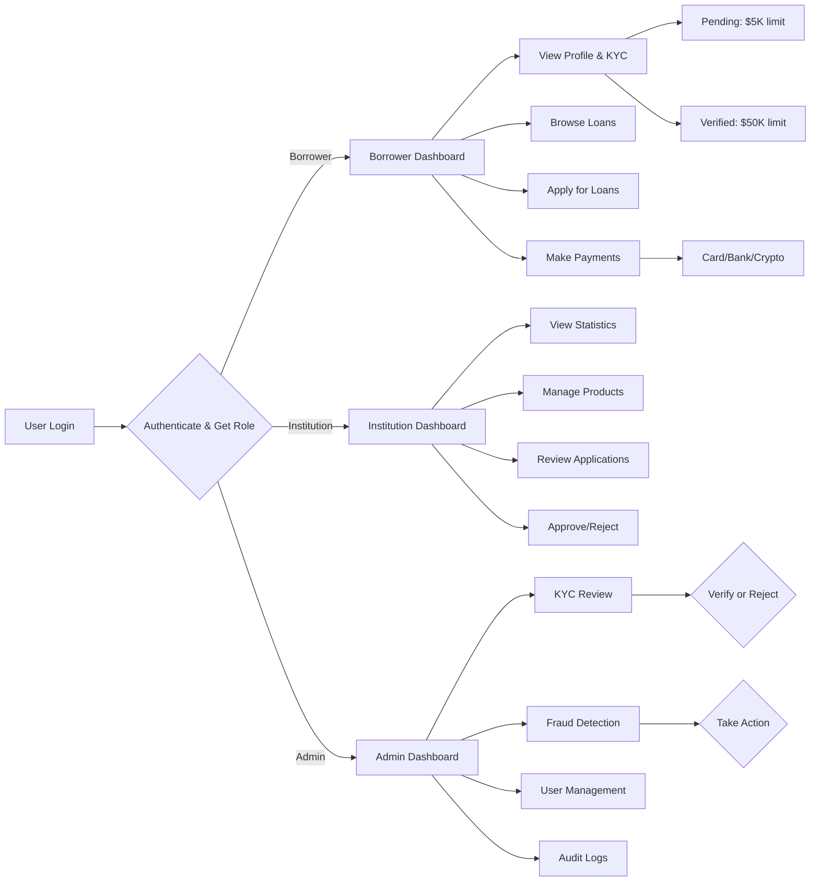
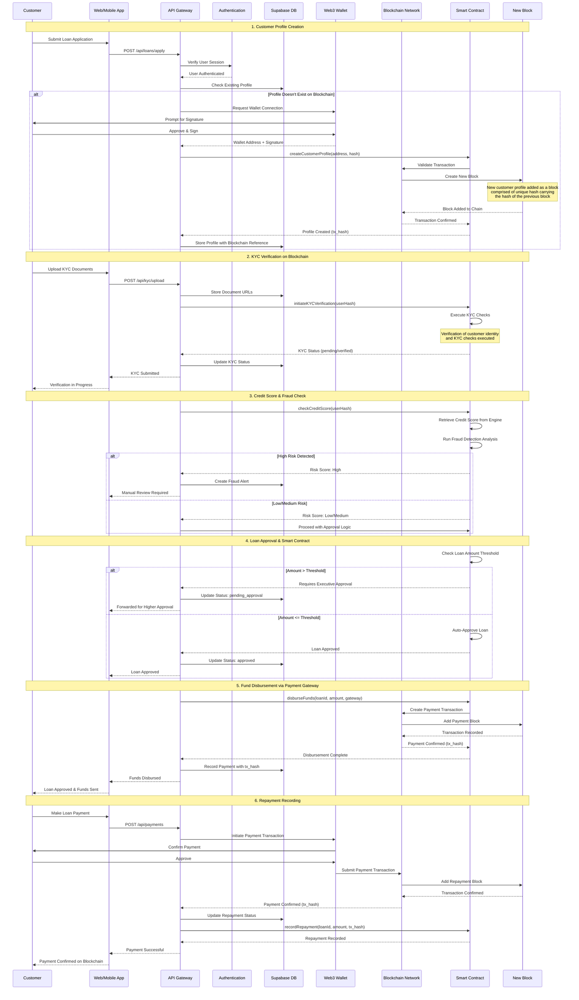
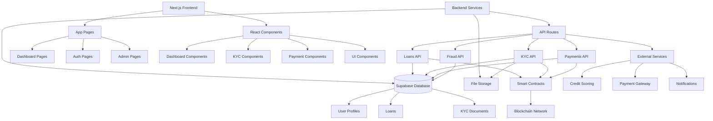

# FinFlow - Smart Microfinance Platform

*Blockchain-powered microfinance with automated KYC, credit scoring, and fraud detection*

[](https://vercel.com/mosesmrimas-projects/v0-microfinance-web-app)
[](https://v0.app/chat/projects/X5j7ozDI0vl)

## Overview

FinFlow is a next-generation microfinance platform that combines traditional lending with blockchain technology to provide fast, transparent, and secure loan services. The platform features automated KYC verification, intelligent fraud detection, credit scoring, and multi-role dashboards for borrowers, financial institutions, and administrators.

### Key Features

- **Blockchain Integration**: Immutable customer profiles and transaction records stored on blockchain
- **Smart Contracts**: Automated loan processing, KYC verification, and fraud detection
- **Multi-Role System**: Separate dashboards for borrowers, institutions, and administrators
- **KYC Automation**: Streamlined identity verification with blockchain-backed records
- **Credit Scoring Engine**: Intelligent risk assessment and credit evaluation
- **Fraud Detection**: Real-time fraud monitoring with risk scoring algorithms
- **Payment Gateway Integration**: Support for cards, bank transfers, and cryptocurrency

---

## Architecture

> **Note**: All diagrams below are rendered using Mermaid. If you're viewing this on GitHub, they should display automatically. To generate PNG versions of these diagrams, you can use tools like [mermaid.ink](https://mermaid.ink/) or [Kroki.io](https://kroki.io/).

### 1. System Architecture

The platform is built on a modern microservices architecture with blockchain integration:


---

### 2. Loan Application User Flow

Complete workflow from customer query to fund disbursement:


---

### 3. Database Schema

Core database structure with Row-Level Security (RLS):


---

### 4. Multi-Role Dashboard Flow

Role-based access control and dashboard features:



---

### 5. Blockchain Integration Flow

Customer profile creation and transaction recording on blockchain:



---

### 6. Component Architecture

Frontend and backend component structure:



---

## Technology Stack

### Frontend
- **Framework**: Next.js 15.1.6 (App Router with Turbopack)
- **UI Library**: React 18
- **Styling**: Tailwind CSS 4 + Radix UI components
- **Forms**: React Hook Form + Zod validation
- **State Management**: React Context + Hooks
- **Charts**: Recharts
- **Icons**: Lucide React

### Backend
- **Database**: Supabase (PostgreSQL)
- **Authentication**: Supabase Auth + Web3 wallet integration
- **Storage**: Supabase Storage (for KYC documents)
- **API**: Next.js API Routes

### Blockchain
- **Network**: Polygon (EVM-compatible)
- **Smart Contracts**: Solidity
- **Web3 Integration**: ethers.js / web3.js
- **Wallet Support**: MetaMask, WalletConnect

### External Services
- **Payment Gateway**: Stripe / PayPal (sandbox)
- **Credit Scoring**: External API integration
- **Notifications**: Email/SMS service
- **Analytics**: Vercel Analytics

---

## Development

### Prerequisites
- Node.js 18+ or Bun
- Supabase account (for database)
- Polygon testnet wallet (for blockchain features)

### Setup

1. **Clone the repository**
   ```bash
   git clone <repository-url>
   cd v0-microfinance-web-app-main
   ```

2. **Install dependencies**
   ```bash
   npm install
   # or
   bun install
   ```

3. **Set up environment variables**
   Create a `.env.local` file:
   ```env
   NEXT_PUBLIC_SUPABASE_URL=your_supabase_url
   NEXT_PUBLIC_SUPABASE_ANON_KEY=your_supabase_anon_key
   SUPABASE_SERVICE_ROLE_KEY=your_service_role_key

   NEXT_PUBLIC_BLOCKCHAIN_NETWORK=polygon_mumbai
   NEXT_PUBLIC_SMART_CONTRACT_ADDRESS=your_contract_address
   ```

4. **Run database migrations**
   Execute SQL scripts in `/scripts/` folder in Supabase SQL Editor:
   - `001_create_tables.sql`
   - `002_create_triggers.sql`
   - `003_create_payment_tables.sql`

5. **Start development server**
   ```bash
   npm run dev
   # or
   bun dev
   ```

6. **Open application**
   Navigate to `http://localhost:3000`

### Build Commands

```bash
# Development server
npm run dev

# Production build
npm run build

# Start production server
npm start

# Lint code
npm run lint
```

---

## Database Schema

The application uses Supabase (PostgreSQL) with Row-Level Security (RLS) enabled on all tables. Key tables include:

- **profiles**: User information with role-based access (borrower, institution, admin)
- **loans**: Loan applications and tracking
- **loan_products**: Available loan products from institutions
- **kyc_documents**: Identity verification documents
- **fraud_detection**: Fraud alerts and risk scoring
- **loan_repayments**: Payment schedules
- **payments**: Payment transactions
- **blockchain_transactions**: On-chain transaction records
- **audit_logs**: System audit trail

All tables have comprehensive RLS policies to ensure data security and privacy.

---

## Smart Contracts

### Deployed Contracts (Polygon Mumbai Testnet)

1. **KYC Contract**: Manages identity verification on-chain
2. **Loan Contract**: Handles loan agreements and approvals
3. **Fraud Detection Contract**: Automated fraud scoring
4. **Payment Contract**: Records loan repayments

### Contract Functions

See `/contracts/` directory for Solidity smart contract code (to be added).

---

## Multi-Role System

The platform supports three user roles with distinct permissions:

### 1. Borrower
- Apply for loans
- Upload KYC documents
- View loan status and payment history
- Make payments (card, bank transfer, crypto)

### 2. Institution
- Create and manage loan products
- Review loan applications
- Approve/reject applications
- Monitor portfolio performance

### 3. Admin
- Review and approve KYC documents
- Monitor fraud detection alerts
- Manage users and permissions
- Access system audit logs

---

## Security Features

- **Row-Level Security (RLS)**: Database-level access control
- **Blockchain Immutability**: Tamper-proof transaction records
- **Smart Contract Automation**: Reduces human error and fraud
- **Multi-signature Approvals**: Executive approval for high-value loans
- **Fraud Detection**: Real-time risk scoring and monitoring
- **Audit Logs**: Complete system activity tracking
- **Data Encryption**: End-to-end encryption for sensitive data

---

## Deployment

### Vercel Deployment

The application is deployed on Vercel and auto-syncs with v0.app.

**Production URL**: [https://vercel.com/mosesmrimas-projects/v0-microfinance-web-app](https://vercel.com/mosesmrimas-projects/v0-microfinance-web-app)

**Continue building**: [https://v0.app/chat/projects/X5j7ozDI0vl](https://v0.app/chat/projects/X5j7ozDI0vl)

### Environment Variables (Vercel)

Configure in Vercel dashboard:
- `NEXT_PUBLIC_SUPABASE_URL`
- `NEXT_PUBLIC_SUPABASE_ANON_KEY`
- `SUPABASE_SERVICE_ROLE_KEY`
- Blockchain contract addresses
- Payment gateway API keys

---

## Contributing

This project is actively developed. For contributions:

1. Create a feature branch
2. Make your changes
3. Submit a pull request
4. Ensure tests pass (when implemented)

---

## License

MIT License - See LICENSE file for details

---

## Support

For issues, questions, or feature requests, please open an issue in the GitHub repository.